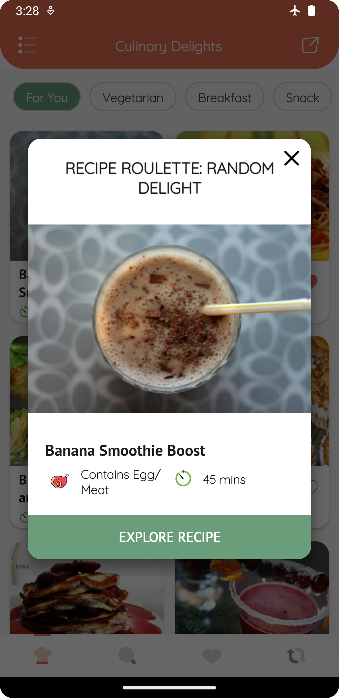
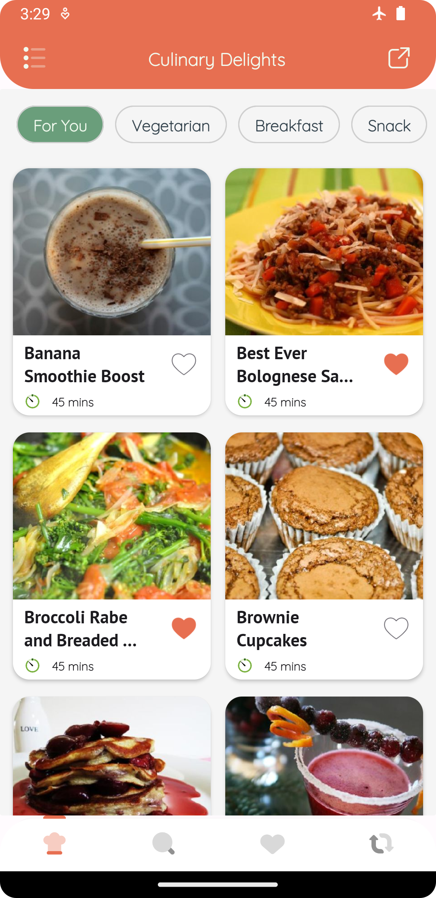
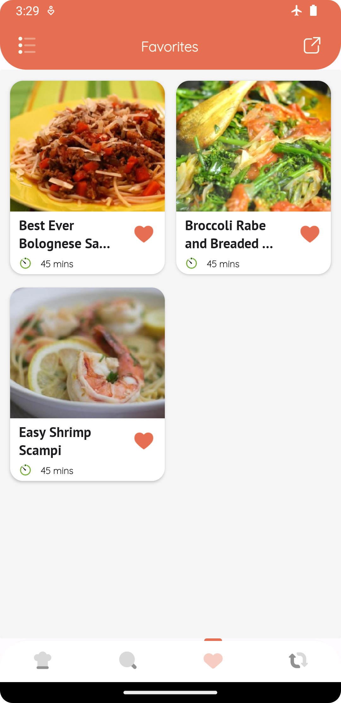
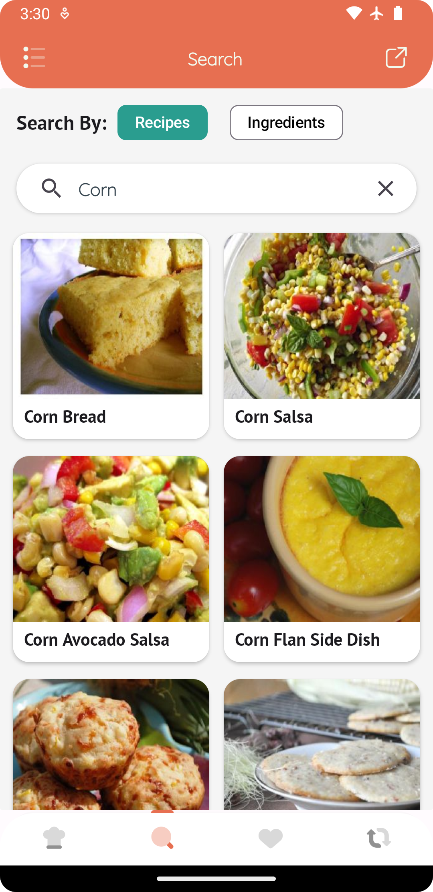
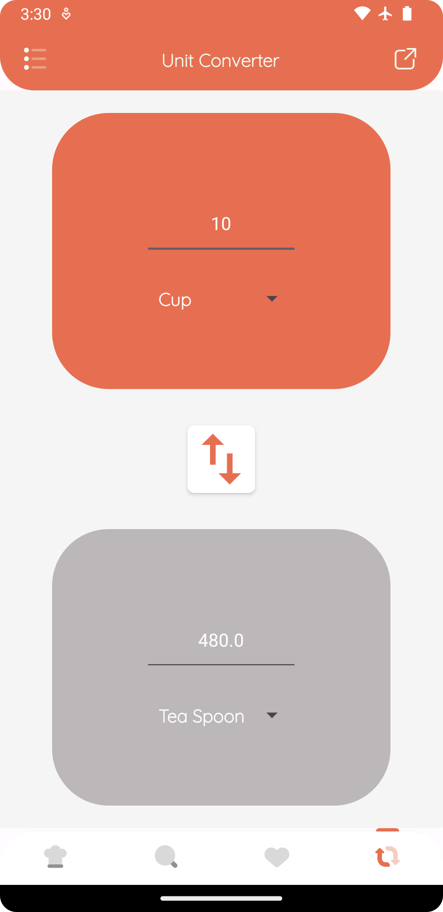

# Recipe Palate

Recipe Palate is your cooking guide to prepare delicious meals with the ingredients that you possess.
Whether have took your first step in the kitchen or you are a seasoned chef, Recipe Palate has something to offer for everyone.
Have an expert on your device to help you become MasterChef.

## App Demos:

[//]: # (- Random Recipe:)
  

[//]: # (- Home:)
  

[//]: # (- Favourites:)
  

[//]: # (- Search:)
  

[//]: # (- Unit Converter:)
  

## Tools used:

- Architecture : MVI 
- Dependency Injection : Hilt 
- Local Database : Room
- Includes remote and local database sync